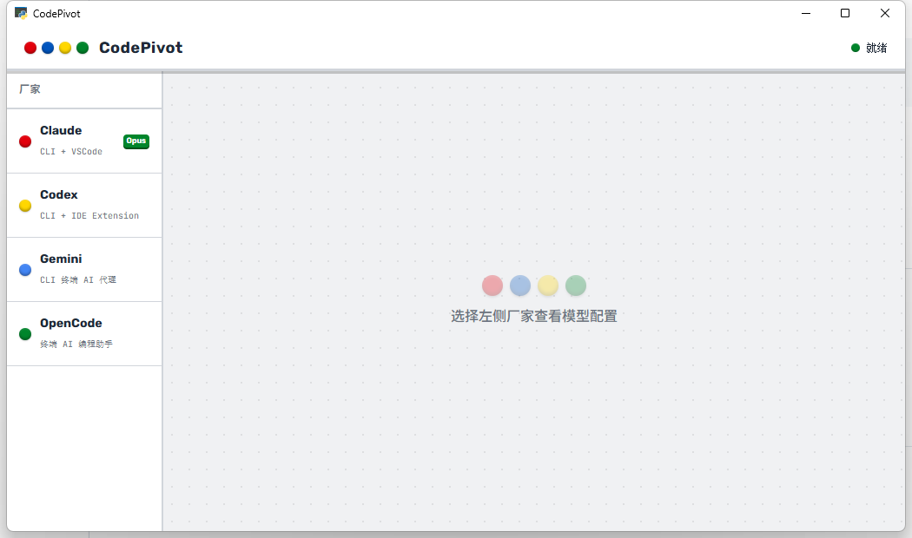

# CodePivot

> 轻量级 AI 编程工具配置一键切换器
>
> A lightweight desktop tool for switching AI coding tool configurations with one click.

## 截图 / Screenshot



## 支持工具

| 工具 | 说明 |
|------|------|
| **Claude Code** | CLI + VSCode 插件 |
| **Codex** | CLI + IDE 扩展 |
| **Gemini CLI** | Google AI 终端代理 |
| **OpenCode** | 开源终端 AI 助手 |

## 功能特性

- ⚔️ **一键切换** — 在多个 API 供应商 / 中转服务之间快速切换
- 📝 **多配置管理** — 每个工具可保存多套 API 配置
- 🛡️ **自动备份** — 切换前自动备份当前配置
- 🔒 **原子写入** — 防止写入中断导致配置文件损坏
- 🪨 **轻量级** — Python + PyWebView，无重型框架依赖

## 快速开始

### 源码运行

```bash
pip install -r requirements.txt
python main.py
```

### 打包安装包

```bash
# 需要 PyInstaller + Inno Setup 6
build.bat
```

打包产物：
- **绿色版**: `dist\AI模型切换器\AI模型切换器.exe`
- **安装包**: `installer_output\CodePivot_Setup_1.0.0.exe`

## 技术栈

- **后端**: Python 3.11+
- **前端**: HTML + Tailwind CSS + Vanilla JS
- **窗口**: PyWebView (Windows 上使用 EdgeChromium)
- **打包**: PyInstaller + Inno Setup

## License

MIT
